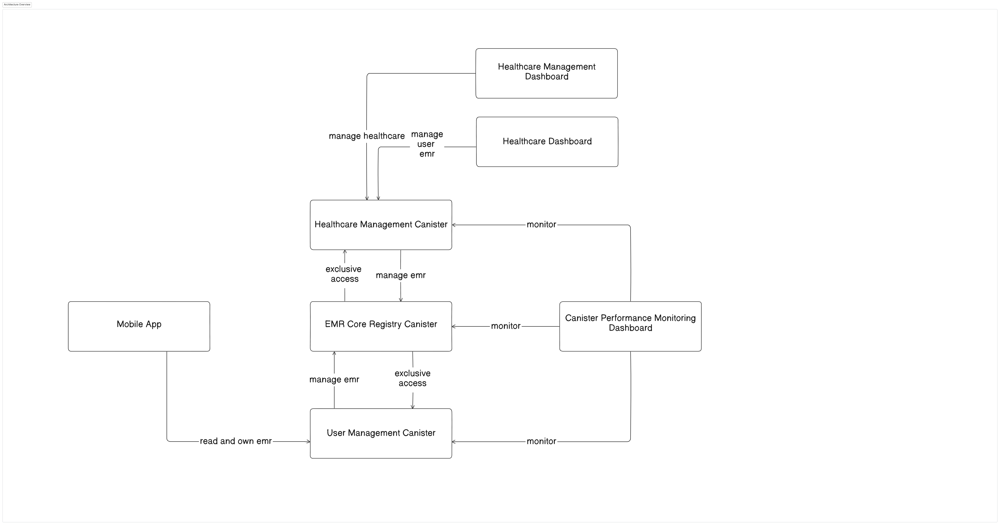

# Medblock Technical Documentation

[](https://internetcomputer.org/)
[](http://medblock.id/)

## 📘 Overview
Medblock is an Electronic Medical Record (EMR) registry system that leverages the power of the Internet Computer to provide secure and efficient healthcare solutions. The project is organized into three main canisters, each designed to fulfill specific responsibilities:

1. **Patient Registry**: Manages comprehensive patient information and records, ensuring easy access by authorized users.
2. **EMR Registry**: Centralizes electronic medical records, facilitating efficient data management and retrieval for healthcare providers.
3. **Provider Registry**: Handles essential information related to healthcare providers, including their credentials and specialties.

## 🏗️ Architecture Diagram
The architectural diagram below provides a visual representation of how the Medblock project is structured and how its components interact. This illustration assists in understanding the relationships and data flow between the Mobile App, various canisters, and the dashboards.


## 📋 Getting Started
### Prerequisites
Ensure you have the following tools installed to work with the Medblock a project:
- **Rust `1.27.0`**: A systems programming language focused on safety and performance.
- **Next.js `14.2.6`**: A React framework for building server-rendered applications.
- **Tailwind CSS `3.4.1`**: A utility-first CSS framework for styling.
- **TypeScript `5.0.0`**: A superset of JavaScript that provides static typing, helping you catch errors early in development.

### Setting Up the Project

Before diving into development, install the essential tools on your system:

1. **DFX**: This is the DFINITY SDK necessary for building, deploying, and managing canisters. Follow the [DFINITY installation guide](https://sdk.dfinity.org/docs/install) for setup instructions.
2. **Candid Extractor**: To install this tool, run:
   ```bash
   cargo install candid-extractor
   ```
3. **Rust wasm32 Target**: Add this target using:
   ```bash
   rustup target add wasm32-unknown-unknown
   ```
4. **IC-Wasm**: Install using:
   ```bash
   cargo install ic-wasm
   ```

### Initial Setup
To set up the environment, execute the `setup.sh` script. This script automates the following tasks:

- Verifies the installation of the required tools.
- Creates unique canister IDs for each registry.
- Generates canister bindings to facilitate communication between them.
- Compiles all three canisters efficiently.

> **Note**: The setup may take a few minutes depending on your system specifications.

### Development Workflow
When developing a feature for a canister, use the build.sh script. This script automatically regenerates the candid interface for the canister you're working on and recompiles the EMR registry canister, as the other two canisters depend on it. If you've already run the setup script, this step should be quick. Use the --all flag with the script to rebuild all canisters simultaneously.

### Deploy Locally
To deploy the canisters locally, navigate to the `scripts/deployments` directory and run the `local.sh` script:

```bash
cd scripts/deployments
./local.sh
```

The `local.sh` script performs the following actions:

- Removes any previous instances of DFX.
- Executes `setup.sh` to confirm all dependencies are updated.
- Deploys the three canisters using the current DFX identity.
- Links all three canisters, ensuring they interact seamlessly.
- Adds the anonymous caller as an authorized caller.

### Running Tests

#### Unit Tests
To run unit tests, compile and execute them using the --release flag to ensure optimal performance:

```bash
cd canister
cargo test --release
```

#### Integration Tests
For integration testing, follow these steps:

1. Install **Pocket-IC** and follow the installation guidelines.
2. Build all canisters with the `--all` flag:
   ```bash
   ./build.sh --all
   ```

3. Compile and run the integration tests:
   ```bash
   cd canister/tests/integration-tests
   cargo test --release
   ```

## Testing

### Integration Tests
To run the integration tests for the canister:
```bash
# Run all integration tests in release mode
cargo integration-test

# Run specific test file
cargo integration-test --test group_tests

# Run specific test
cargo integration-test --test group_tests test_group_creation_and_emr_access

# Show println output
cargo integration-test -- --nocapture
```

The integration tests are located in `canister/tests/integration-tests/` and test the full functionality of the canisters including:
- Group management
- EMR access control
- Patient registration
- Provider interactions

### Unit Tests
For unit tests, you can use the standard cargo test command in each canister directory:
```bash
cd canister/src/patient_registry
cargo test
```

### Private VPS Node
We have setup a private VPS node to act as a psuedo-staging branch for the canisters.

To connect to the node instead of local or mainnet, you can use the following command:
```bash
./portforward.sh
```

This will forward the port to the node hosted in the VPS and you can interact with the node as if it were local. 